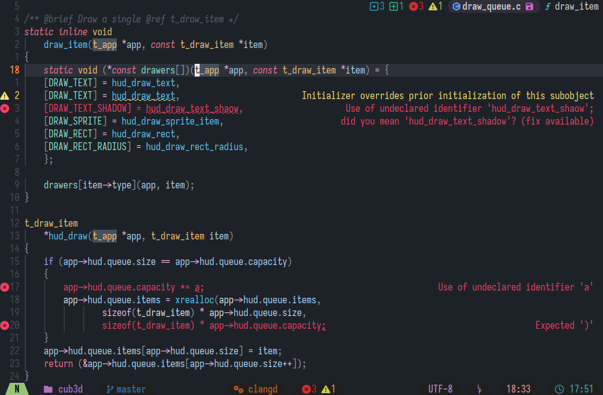

**Display LSP diagnostics on the right**



## Configuration

```
opts = {
    -- Empty space to preserve between content and diagnostic line
	spacing_ratio = 0.2,
    -- Cell padding
	padding_right = 1,

	highlights = {
        -- Error diagnostics highlight
        error = { fg = "#ff0000" },
        -- Warning diagnostics highlight
        warn = { fg = "#ff7f00" },
        -- Info diagnostics highlight
        info = { fg = "#5fff5f" },
        -- Hint diagnostics highlight
        hint = { fg = "#5f5fff" },
    }
}
```

**Default configuration**
```
opts = {
	spacing_ratio = 0.2,
	padding_right = 1,

	highlights = {} -- Uses @Diagnostic*'s foreground
}
```

## LICENSE

This project is licensed under the GNU GPL version 3. See [LICENSE](./LICENSE) for more information.
